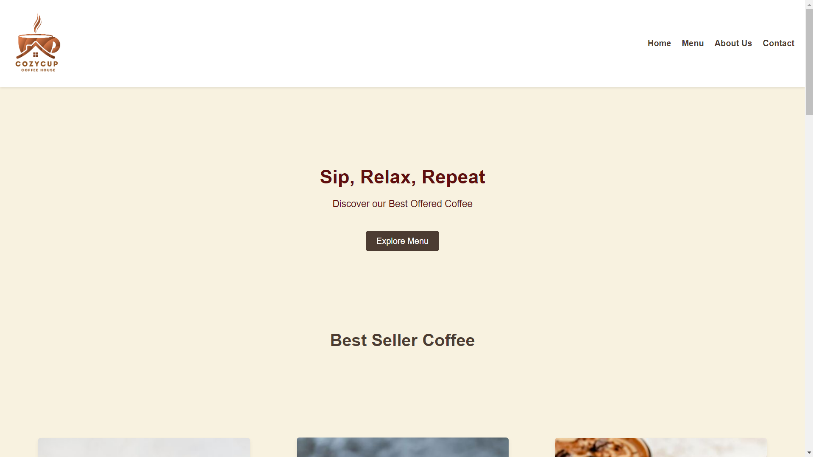
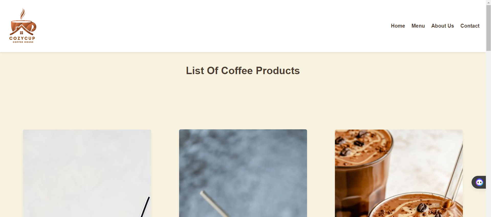
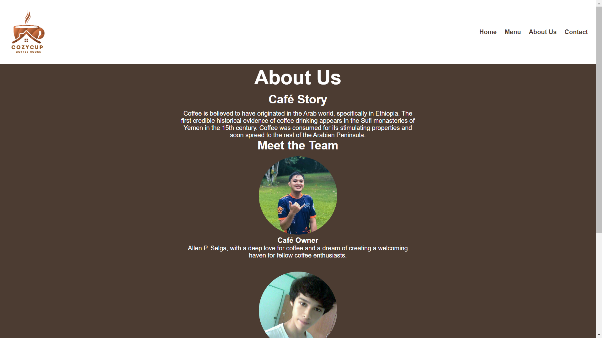
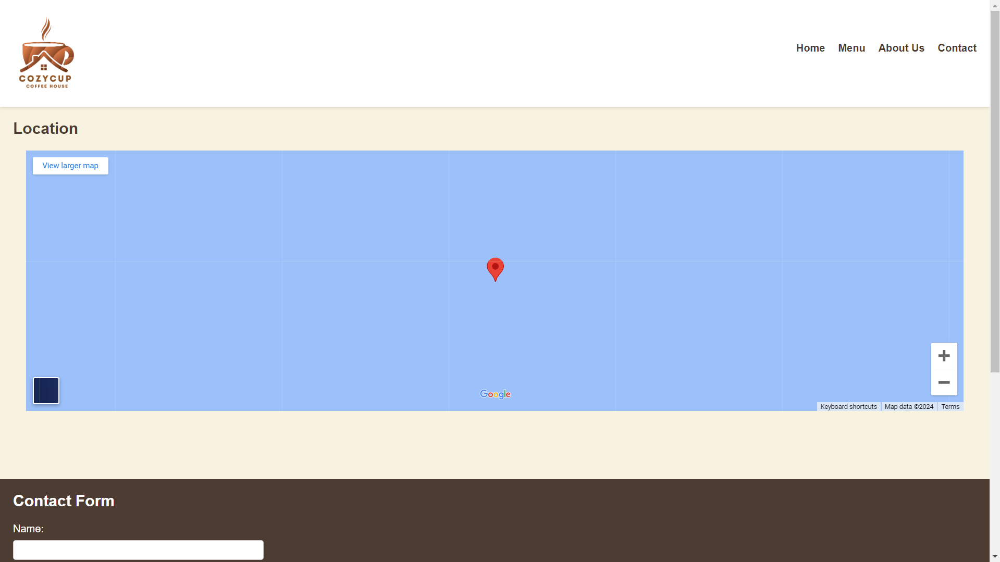

# Cozy Cup Cafe

## Project Description
Cozy Cup Cafe is a web application designed to help users discover and explore cozy cafes in their area. Whether you're looking for a quiet place to work, meet friends, or simply enjoy a good cup of coffee, Cozy Cup Cafe has you covered. With user-friendly features and a sleek interface, finding your new favorite spot has never been easier.

## Features
- Search for cafes by location
- View Menu Page, including photos,price and descriptions of each item. 
- About Us  page with information about the business and its mission statement.
- Social Media links to connect with friends on various platforms.

## Screen Captures

### Home Page
(img/h2.png)(img/h3.png)(img/h4.png)
The home page welcomes users and provides a search bar to begin exploring cafes in their area.

### Menu Page
(img/m2.png)
The menu page displays information about a selected cafe, including photos.

### About Us Page
(img/a2.png)
Users can view the content about the business
### Contact Page
(img/c2.png)
The contact page displays the location of the coffee shop and form that the user can 

## About the Authors

- **Name:** Jubil L. Cabrestante
- **Email:** Cabrestantejubil1@gmail.com

Connect with me:

