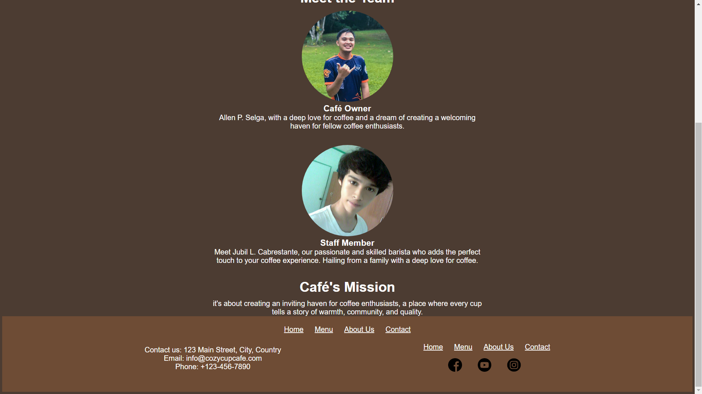

# Cozy Cup Cafe

## Project Description
Cozy Cup Cafe is a web application designed to help users discover and explore cozy cafes in their area. Whether you're looking for a quiet place to work, meet friends, or simply enjoy a good cup of coffee, Cozy Cup Cafe has you covered. With user-friendly features and a great interface, finding your new favorite spot has never been easier.

## Features
- Preview of Best Seller  Coffee Drink and Pastry.
- View Menu Page, including photos,price and descriptions of each item. 
- About Us  page with information about the business and its mission statement.
- Social Media links to connect with friends on various platforms.
- Preview Location  of the cafe using Google Maps API.
## Screen Captures

### Home Page

The home page welcomes users and browse to begin exploring cafes in their area.

### Menu Page

The menu page displays information about a selected cafe, including photos.

### About Us Page

Users can view the content about the business and the members of the CozyCupCoffee House

### Contact Page

The contact page displays the location of the coffee shop and form that the user can 

## About the Authors

- __Name: __Jubil L. Cabrestante
- __Email: __201980170@psu.palawan.edu.ph

Connect with me:

